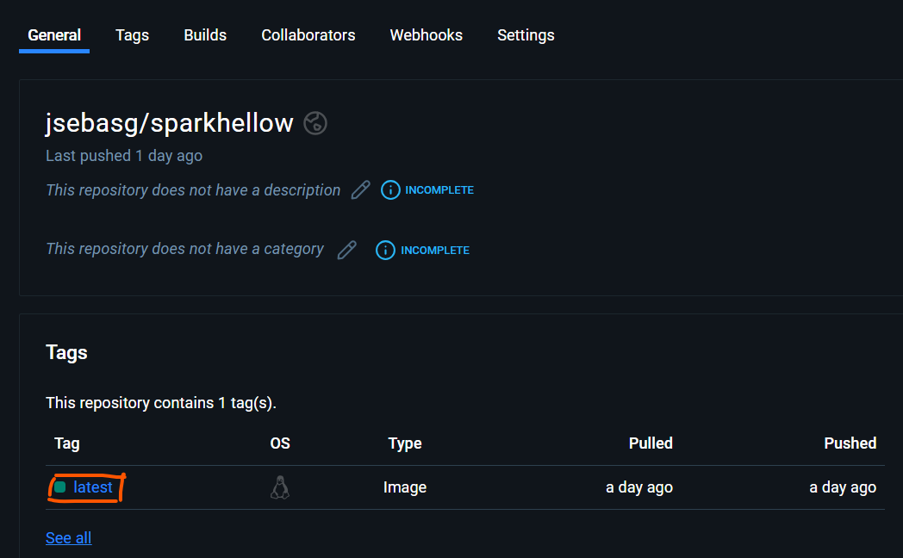
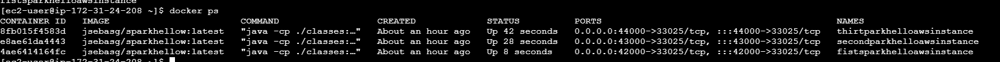
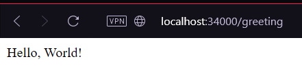
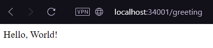
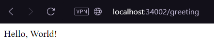
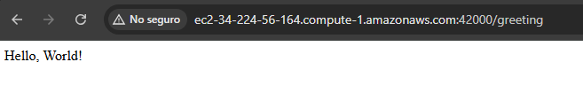

# Aplicación basica

Este proyecto consiste en una aplicación simple diseñada para practicar conceptos de virtualización y programación distribuida. Demuestra el despliegue completo de una aplicación Java con Spring Boot, contenerizada con Docker y desplegada en AWS. La aplicacion ejecuuta un hello world unicamente para verificar el despliegue exitoso

## Contenidos

- [Arquitectura](#arquitectura)
- [Configuración](#configuración)
- [Contenerización con Docker](#contenerización-con-docker)
- [Despliegue en AWS](#despliegue-en-aws)
- [Pruebas y Uso](#pruebas-y-uso)
- [Capturas y Logs](#capturas-y-logs)

---

## Arquitectura

### Componentes

1. **API Gateway (Spring Boot)**: Una API gateway en Spring Boot alojada en una instancia de EC2, que enruta las solicitudes hace al aplicacion. 
2. **Backend**: Servicio monolítico en Java en un contenedor Docker, que gestiona el envio del mensaje de confirmacion. 

---

## Configuración

### Prerrequisitos
1. Asegúrate de tener instalados Java (versión 17 o superior), Maven y Docker.
2. Cuenta en DockerHub para almacenar las imágenes de despliegue.
3. Cuenta en AWS con permisos para lanzar instancias EC2.

### Paso 1: Construcción de la Aplicación Spring Boot

1. Crea un proyecto en Java con Maven.
2. Implementa la aplicación Spring Boot con un endpoint de saludo:

    - **Controlador**: `HelloRestController`

    ```java
    package com.example.dockeraws;

    import org.springframework.web.bind.annotation.GetMapping;
    import org.springframework.web.bind.annotation.RequestParam;
    import org.springframework.web.bind.annotation.RestController;

    @RestController
    public class HelloRestController {
        private static final String template = "Hello, %s!";

        @GetMapping("/greeting")
        public String greeting(@RequestParam(value = "name", defaultValue = "World") String name) {
            return String.format(template, name);
        }
    }
    ```

    - **Aplicación**: `RestServiceApplication`

    ```java
    package com.example.dockeraws;

    import org.springframework.boot.SpringApplication;
    import org.springframework.boot.autoconfigure.SpringBootApplication;

    import java.util.Collections;

    @SpringBootApplication
    public class RestServiceApplication {
        public static void main(String[] args) {
            SpringApplication app = new SpringApplication(RestServiceApplication.class);
            app.setDefaultProperties(Collections.singletonMap("server.port", getPort()));
            app.run(args);
        }

        private static int getPort() {
            if (System.getenv("PORT") != null) {
                return Integer.parseInt(System.getenv("PORT"));
            }
            return 33025;
        }
    }
    ```

3. Compila el proyecto usando:

    ```bash
    mvn clean install
    ```

Este formato garantiza que el código esté correctamente indentado y legible en el archivo README.

### Subida de Imagen a DockerHub
1. Etiqueta y sube la imagen:
   ```bash
   docker tag dockersparkprimer <DockerHubUsername>/app
   docker push <DockerHubUsername>/app
   ```
   

---

## Despliegue en AWS

### Configuración en EC2
1. Lanza una instancia EC2 con Docker instalado.
2. Extrae y ejecuta la imagen Docker desde DockerHub:
   ```bash
   docker run -d -p 42000:33025 --name arrival-list-app <DockerHubUsername>/app
   ```
   

3. Configura el grupo de seguridad para permitir el acceso de entrada en el puerto especificado.
4. crea cada una de las intancias en un puerto distinto
   ```bash
   sudo docker run -d -p 42000:33025 --name fistsparkhelloawsinstance jsebasg/sparkhellow:latest 
   ```

---

## Pruebas y Uso

### Pruebas Locales
1. Accede a la aplicación localmente(apuntando a los contenedores):
   
   http://localhost:34000/greeting
   
   
   
   http://localhost:34001/greeting
   
   

   http://localhost:34002/greeting
   
   
   

### Pruebas en AWS
1. Accede a la aplicación desplegada en AWS:
   
   http://<TU_IP_EC2>:42000/greeting
   
   
